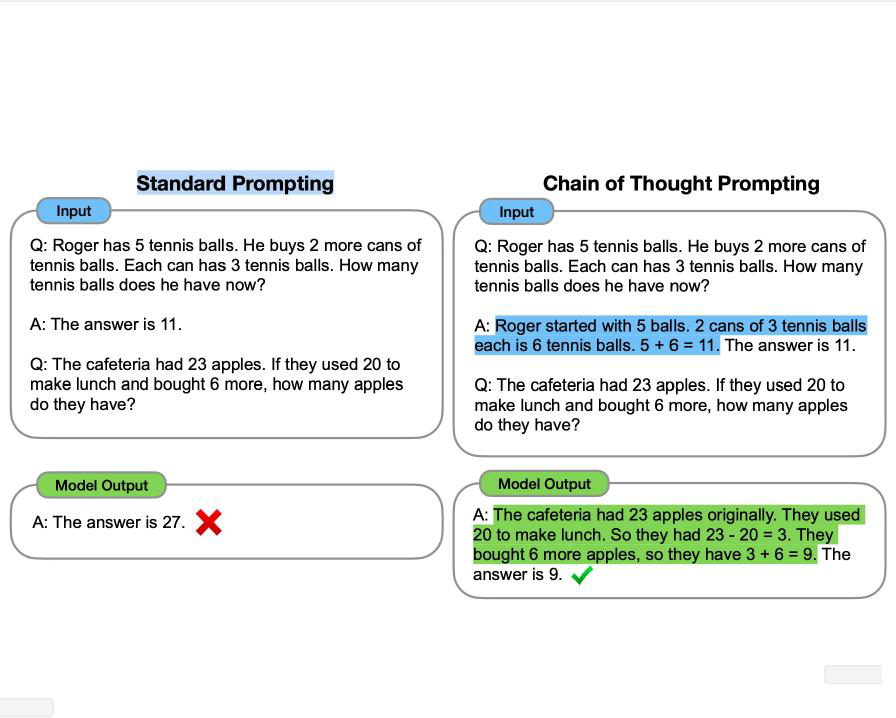

## 01. LLM 相关

### 1.1 什么是生成式大模型？

生成式大模型（一般简称大模型 LLMs）是指能用于创作新内容，例如文本、图片、音频以及视频的一类深度学习模型。相比普通深度学习模型，主要有两点不同：
1. 模型参数量更大，参数量都在 Billion级别；
2. 可通过条件或上下文引导，产生生成式的内容（所谓的 prompt engineer就是由此而来）。

### 1.2 大模型是怎么让生成的文本丰富而不单调的呢？

1. 从训练角度来看：
   - 基于 Transformer的模型参数量巨大，有助于模型学习到多样化的语言模式与结构；
   - 各种模型微调技术的出现，例如 P-Tuning、Lora，让大模型微调成本更低，也可以让模型在垂直领域有更强的生成能力；
   - 在训练过程中加入一些设计好的 loss，也可以更好地抑制模型生成单调内容；
2. 从推理角度来看：
   - 基于 Transformer 的模型可以通过引入各种参数与策略，例如 temperature，nucleus samlper来改变每次生成的内容。

### 1.3 什么是 LLMs复读机问题？

1. 字符级别重复，指大模型针对一个字或一个词重复不断的生成，例如在电商翻译场景上，会出现“steckdose steckdose steckdose steckdose steckdose steckdose steckdose steckdose...”。
2. 语句级别重复，大模型针对一句话重复不断的生成例如在多模态大模型图片理解上，生成的结果可能会不断重复图片的部分内容，比如“这是一个杯子，这是一个杯子 ...”。
3. 章节级别重复，多次相同的 prompt输出完全相同或十分近似的内容，没有一点创新性的内容比如你让大模型给你写一篇关于春天的小作文，结果发现大模型的生成结果千篇一律，甚至近乎一摸一样。
4. 大模型针对不同的 prompt也可能会生成类似的内容，且有效信息很少、信息熵偏低。

### 1.4 各个专业领域是否需要各自的大模型来服务？

各个专业领域通常需要各自的大模型来服务，原因如下：
1. 领域特定知识：不同领域拥有各自特定的知识和术语，需要针对该领域进行训练的大模型才能更好地理解和处理相关文本。例如，在医学领域，需要训练具有医学知识的大模型，以更准确地理解和生成医学文本。
2. 语言风格和惯用语：各个领域通常有自己独特的语言风格和惯用语，这些特点对于模型的训练和生成都很重要。专门针对某个领域进行训练的大模型可以更好地掌握该领域的语言特点，生成更符合该领域要求的文本。
3. 领域需求的差异：不同领域对于文本处理的需求也有所差异。例如，金融领域可能更关注数字和统计数据的处理，而法律领域可能更关注法律条款和案例的解析。因此，为了更好地满足不同领域的需求，需要专门针对各个领域进行训练的大模型。
4. 数据稀缺性：某些领域的数据可能相对较少，无法充分训练通用的大模型。针对特定领域进行训练的大模型可以更好地利用该领域的数据，提高模型的性能和效果。
尽管需要各自的大模型来服务不同领域，但也可以共享一些通用的模型和技术。例如，通用的大模型可以用于处理通用的文本任务，而领域特定的模型可以在通用模型的基础上进行微调和定制，以适应特定领域的需求。这样可以在满足领域需求的同时，减少模型的重复训练和资源消耗。

### 1.5 大模型大概有多大，模型文件有多大?

一般放出来的模型文件都是 fp16 的，假设是一个 n B 的模型，那么模型文件占 2n G，fp16加载到显存里做推理也是占 2n G，对外的 pr 都是 10n亿参数的模型。

### 1.6 能否用 4 * v100 32G 训练 vicuna 65b？

不能。首先，llama 65b 的权重需要 5* v100 32G 才能完整加载到 GPU。其次，vicuna 使用flash- attention 加速训练，暂不支持 v100，需要 turing 架构之后的显卡。（fastchat 上可以通过调用train脚本训练 vicuna 而非 train_mem，其实也是可以训练的）

### 1.7 nB 模型推理需要多少显存？

考虑模型参数都是 fp16，2nG的显存能把模型加载。

### 1.8 大模型 LLM的训练目标是什么？

大型语言模型（Large Language Models，LLM）的训练目标通常是最大似然估计（Maximum Likelihood Estimation，MLE）。最大似然估计是一种统计方法，用于从给定数据中估计概率模型的参数。
在 LLM的训练过程中，使用的数据通常是大量的文本语料库。训练目标是最大化模型生成训练数据中观察到的文本序列的概率。具体来说，对于每个文本序列，模型根据前面的上下文生成下一个词的条件概率分布，并通过最大化生成的词序列的概率来优化模型参数。
为了最大化似然函数，可以使用梯度下降等优化算法来更新模型参数，使得模型生成的文本序列的概率逐步提高。在训练过程中，通常会使用批量训练（batch training）的方法，通过每次处理一小批数据样本来进行参数更新。

### 1.9 涌现能力是啥原因？

涌现能力（Emergent Ability）是指模型在训练过程中能够生成出令人惊喜、创造性和新颖的内容或行为。这种能力使得模型能够超出其训练数据所提供的内容，并产生出具有创造性和独特性的输出。
涌现能力的产生可以归因于以下几个原因：
- 任务的评价指标不够平滑：因为很多任务的评价指标不够平滑，导致我们现在看到的涌现现象。如果评价指标要求很严格，要求一字不错才算对，那么 Emoji_movie任务我们就会看到涌现现象的出现。但是，如果我们把问题形式换成多选题，就是给出几个候选答案，让 LLM选，那么随着模型不断增大，任务效果在持续稳定变好，但涌现现象消失，如上图图右所示。这说明评价指标不够平滑，起码是一部分任务看到涌现现象的原因。
- 复杂任务 vs子任务：展现出涌现现象的任务有一个共性，就是任务往往是由多个子任务构成的复杂任务。也就是说，最终任务过于复杂，如果仔细分析，可以看出它由多个子任务构成，这时候，子任务效果往往随着模型增大，符合 Scaling Law，而最终任务则体现为涌现现象。
- 用 Grokking（顿悟）来解释涌现：对于某个任务 T，尽管我们看到的预训练数据总量是巨大的，但是与 T相关的训练数据其实数量很少。当我们推大模型规模的时候，往往会伴随着增加预训练数据的数据量操作，这样，当模型规模达到某个点的时候，与任务 T相关的数据量，突然就达到了最小要求临界点，于是我们就看到了这个任务产生了 Grokking现象。
尽管涌现能力为模型带来了创造性和独特性，但也需要注意其生成的内容可能存在偏差、错误或不完整性。因此，在应用和使用涌现能力强的模型时，需要谨慎评估和验证生成的输出，以确保其质量和准确性。

### 1.10 如何缓解 LLMs复读机问题？

为了缓解 LLMs复读机问题，可以尝试以下方法：
- 多样性训练数据：在训练阶段，使用多样性的语料库来训练模型，避免数据偏差和重复文本的问题。这可以包括从不同领域、不同来源和不同风格的文本中获取数据。
- 引入噪声：在生成文本时，引入一些随机性或噪声，例如通过采样不同的词或短语，或者引入随机的变换操作，以增加生成文本的多样性。这可以通过在生成过程中对模型的输出进行采样或添加随机性来实现。
- 温度参数调整：温度参数是用来控制生成文本的多样性的一个参数。通过调整温度参数的值，可以控制生成文本的独创性和多样性。较高的温度值会增加随机性，从而减少复读机问题的出现。
- Beam 搜索调整：在生成文本时，可以调整 Beam 搜索算法的参数。Beam搜索是一种常用的生成策略，它在生成过程中维护了一个候选序列的集合。通过调整 Beam大小和搜索宽度，可以控制生成文本的多样性和创造性。
- 后处理和过滤：对生成的文本进行后处理和过滤，去除重复的句子或短语，以提高生成文本的质量和多样性。可以使用文本相似度计算方法或规则来检测和去除重复的文本。
- 人工干预和控制：对于关键任务或敏感场景，可以引入人工干预和控制机制，对生成的文本进行审查和筛选，确保生成结果的准确性和多样性。
需要注意的是，缓解 LLMs复读机问题是一个复杂的任务，没有一种通用的解决方案。不同的方法可能适用于不同的场景和任务，需要根据具体情况进行选择和调整。此外，解决复读机问题还需要综合考虑数据、训练目标、模型架构和生成策略等多个因素，需要进一步的研究和实践来提高大型语言模型的生成文本多样性和创造性。

### 1.11 LLMs输入句子长度理论上可以无限长吗？

理论上来说，LLMs（大型语言模型）可以处理任意长度的输入句子，但实际上存在一些限制和挑战。下面是一些相关的考虑因素：
- 计算资源：生成长句子需要更多的计算资源，包括内存和计算时间。由于 LLMs通常是基于神经网络的模型，计算长句子可能会导致内存不足或计算时间过长的问题。
- 模型训练和推理：训练和推理长句子可能会面临一些挑战。在训练阶段，处理长句子可能会导致梯度消失或梯度爆炸的问题，影响模型的收敛性和训练效果。在推理阶段，生成长句子可能会增加模型的错误率和生成时间。
- 上下文建模：LLMs是基于上下文建模的模型，长句子的上下文可能会更加复杂和深层。模型需要能够捕捉长句子中的语义和语法结构，以生成准确和连贯的文本。

### 1.12 如何让大模型处理更长的文本？

要让大模型处理更长的文本，可以考虑以下几个方法：
1. 分块处理：将长文本分割成较短的片段，然后逐个片段输入模型进行处理。这样可以避免长文本对模型内存和计算资源的压力。在处理分块文本时，可以使用重叠的方式，即将相邻片段的一部分重叠，以保持上下文的连贯性。
2. 层次建模：通过引入层次结构，将长文本划分为更小的单元。例如，可以将文本分为段落、句子或子句等层次，然后逐层输入模型进行处理。这样可以减少每个单元的长度，提高模型处理长文本的能力。
3. 部分生成：如果只需要模型生成文本的一部分，而不是整个文本，可以只输入部分文本作为上下文，然后让模型生成所需的部分。例如，输入前一部分文本，让模型生成后续的内容。
4. 注意力机制：注意力机制可以帮助模型关注输入中的重要部分，可以用于处理长文本时的上下文建模。通过引入注意力机制，模型可以更好地捕捉长文本中的关键信息。
5. 模型结构优化：通过优化模型结构和参数设置，可以提高模型处理长文本的能力。例如，可以增加模型的层数或参数量，以增加模型的表达能力。还可以使用更高效的模型架构，如Transformer等，以提高长文本的处理效率。
需要注意的是，处理长文本时还需考虑计算资源和时间的限制。较长的文本可能需要更多的内存和计算时间，因此在实际应用中需要根据具体情况进行权衡和调整。

### 1.13 为什么大模型推理时显存涨的那么多还一直占着？

大语言模型进行推理时，显存涨得很多且一直占着显存不释放的原因主要有以下几点：
1. 模型参数占用显存：大语言模型通常具有巨大的参数量，这些参数需要存储在显存中以供推理使用。因此，在推理过程中，模型参数会占用相当大的显存空间。
2. 输入数据占用显存：进行推理时，需要将输入数据加载到显存中。对于大语言模型而言，输入数据通常也会占用较大的显存空间，尤其是对于较长的文本输入。
3. 中间计算结果占用显存：在推理过程中，模型会进行一系列的计算操作，生成中间结果。这些中间结果也需要存储在显存中，以便后续计算使用。对于大语言模型而言，中间计算结果可能会占用较多的显存空间。
4. 内存管理策略：某些深度学习框架在推理时采用了一种延迟释放显存的策略，即显存不会立即释放，而是保留一段时间以备后续使用。这种策略可以减少显存的分配和释放频率，提高推理效率，但也会导致显存一直占用的现象。
需要注意的是，显存的占用情况可能会受到硬件设备、深度学习框架和模型实现的影响。不同的环境和设置可能会导致显存占用的差异。如果显存占用过多导致资源不足或性能下降，可以考虑调整模型的批量大小、优化显存分配策略或使用更高性能的硬件设备来解决问题。

### 1.14 大模型在 GPU 和 CPU上推理速度如何？

大语言模型在 GPU 和 CPU 上进行推理的速度存在显著差异。一般情况下，GPU在进行深度学习推理任务时具有更高的计算性能，因此大语言模型在 GPU 上的推理速度通常会比在 CPU上更快。
以下是 GPU 和 CPU在大语言模型推理速度方面的一些特点：
1. GPU推理速度快：GPU具有大量的并行计算单元，可以同时处理多个计算任务。对于大语言模型而言，GPU可以更高效地执行矩阵运算和神经网络计算，从而加速推理过程。
2. CPU推理速度相对较慢：相较于 GPU，CPU 的计算能力较弱，主要用于通用计算任务。虽然 CPU也可以执行大语言模型的推理任务，但由于计算能力有限，推理速度通常会较慢。
3. 使用 GPU 加速推理：为了充分利用 GPU 的计算能力，通常会使用深度学习框架提供的 GPU加速功能，如 CUDA 或 OpenCL。这些加速库可以将计算任务分配给 GPU并利用其并行计算能力，从而加快大语言模型的推理速度。
需要注意的是，推理速度还受到模型大小、输入数据大小、计算操作的复杂度以及硬件设备的性能等因素的影响。因此，具体的推理速度会因具体情况而异。一般来说，使用 GPU进行大语言模型的推理可以获得更快的速度。

### 1.15 推理速度上，INT8 和 FP16比起来怎么样？

在大语言模型的推理速度上，使用 INT8（8 位整数量化）和 FP16（半精度浮点数）相对于 FP32（单精度浮点数）可以带来一定的加速效果。这是因为 INT8 和 FP16的数据类型在表示数据时所需的内存和计算资源较少，从而可以加快推理速度。
具体来说，INT8在相同的内存空间下可以存储更多的数据，从而可以在相同的计算资源下进行更多的并行计算。这可以提高每秒推理操作数（Operations Per Second，OPS）的数量，加速推理速度。
FP16 在相对较小的数据范围内进行计算，因此在相同的计算资源下可以执行更多的计算操作。虽然FP16的精度相对较低，但对于某些应用场景，如图像处理和语音识别等，FP16的精度已经足够满足需求。
需要注意的是，INT8 和 FP16的加速效果可能会受到硬件设备的支持程度和具体实现的影响。某些硬件设备可能对 INT8 和 FP16有更好的优化支持，从而进一步提高推理速度。
综上所述，使用 INT8 和 FP16数据类型可以在大语言模型的推理过程中提高推理速度，但需要根据具体场景和硬件设备的支持情况进行评估和选择。

### 1.16 大模型生成时的参数怎么设置？

1. Temperature：用于调整随机从生成模型中抽样的程度，使得相同的提示可能会产生不同的输出。温度为 0将始终产生相同的输出，该参数设置越高随机性越大。
2. 波束搜索宽度：波束搜索是许多 NLP和语音识别模型中常用的一种算法，作为在给定可能选项的情况下选择最佳输出的最终决策步骤。波束搜索宽度是一个参数，用于确定算法在搜索的每个步骤中应该考虑的候选数量。
3. Top p：动态设置 tokens 候选列表的大小。将可能性之和不超过特定值的 top tokens列入候选名单。Top p 通常设置为较高的值（如 0.75），目的是限制可能被采样的低概率 token的长度。
4. Top k：允许其他高分 tokens 有机会被选中。这种采样引入的随机性有助于在很多情况下生成的质量。Top k 参数设置为 3 则意味着选择前三个 tokens。
若 Top k 和 Top p 都启用，则 Top p 在 Top k之后起作用。

### 1.17 有哪些省内存的大语言模型训练 / 微调 /推理方法？

有一些方法可以帮助省内存的大语言模型训练、微调和推理，以下是一些常见的方法：
1. 参数共享（Parameter Sharing）：通过共享模型中的参数，可以减少内存占用。例如，可以在不同的位置共享相同的嵌入层或注意力机制。
2. 梯度累积（Gradient Accumulation）：在训练过程中，将多个小批次的梯度累积起来，然后进行一次参数更新。这样可以减少每个小批次的内存需求，特别适用于 GPU内存较小的情况。
3. 梯度裁剪（Gradient Clipping）：通过限制梯度的大小，可以避免梯度爆炸的问题，从而减少内存使用。
4. 分布式训练（Distributed Training）：将训练过程分布到多台机器或多个设备上，可以减少单个设备的内存占用。分布式训练还可以加速训练过程。
5. 量化（Quantization）：将模型参数从高精度表示（如 FP32）转换为低精度表示（如 INT8或FP16），可以减少内存占用。量化方法可以通过减少参数位数或使用整数表示来实现。
6. 剪枝（Pruning）：通过去除冗余或不重要的模型参数，可以减少模型的内存占用。剪枝方法可以根据参数的重要性进行选择，从而保持模型性能的同时减少内存需求。
7. 蒸馏（Knowledge Distillation）：使用较小的模型（教师模型）来指导训练较大的模型（学生模型），可以从教师模型中提取知识，减少内存占用。
8. 分块处理（Chunking）：将输入数据或模型分成较小的块进行处理，可以减少内存需求。例如，在推理过程中，可以将较长的输入序列分成多个较短的子序列进行处理。
这些方法可以结合使用，根据具体场景和需求进行选择和调整。同时，不同的方法可能对不同的模型和任务有不同的效果，因此需要进行实验和评估。

### 1.18 如何让大模型输出合规化

要让大模型输出合规化，可以采取以下方法：
1. 数据清理和预处理：在进行模型训练之前，对输入数据进行清理和预处理，以确保数据符合合规要求。这可能包括去除敏感信息、匿名化处理、数据脱敏等操作。
2. 引入合规性约束：在模型训练过程中，可以引入合规性约束，以确保模型输出符合法律和道德要求。例如，可以在训练过程中使用合规性指标或损失函数来约束模型的输出。
3. 限制模型访问权限：对于一些特定的应用场景，可以通过限制模型的访问权限来确保输出的合规性。只允许授权用户或特定角色访问模型，以保护敏感信息和确保合规性。
4. 解释模型决策过程：为了满足合规性要求，可以对模型的决策过程进行解释和解释。通过提供透明的解释，可以使用户或相关方了解模型是如何做出决策的，并评估决策的合规性。
5. 审查和验证模型：在模型训练和部署之前，进行审查和验证以确保模型的输出符合合规要求。这可能涉及到法律专业人士、伦理专家或相关领域的专业人士的参与。
6. 监控和更新模型：持续监控模型的输出，并根据合规要求进行必要的更新和调整。及时发现和解决合规性问题，确保模型的输出一直保持合规。
7. 合规培训和教育：为使用模型的人员提供合规培训和教育，使其了解合规要求，并正确使用模型以确保合规性。
需要注意的是，合规性要求因特定领域、应用和地区而异，因此在实施上述方法时，需要根据具体情况进行调整和定制。同时，合规性是一个动态的过程，需要与法律、伦理和社会要求的变化保持同步。

### 1.19 如何让 GPT工作得更好？

魔法提示词：“让我们一步步地思考。（let's think step by step）”，通过告诉模型，让它一步一步地解决问题，它可能会给出更加可靠的答案。
专家假设提示词：你可以说，“假设你是一个领域专家，假设你的 IQ 是 120。”通过加入这样的提示词，LLM 会倾向于给出更高质量的答案。注意：不要提出过高的要求，比如说，“假设你的 IQ 是 400”，这可能会超出数据分布范围，甚至可能让模型在科幻数据分布中进行角色扮演。
规避它的弱点：我们知道现有的 LLM 并不擅长计算。针对这个问题，你可以告诉它，“你的心算不太好。每当你需要进行大数加法、乘法或其他操作时，请使用这个计算器（插件）。以下是你如何使用计算器。”

### 1.20 LLM应用开发基础术语

1. 大模型：一般指 1亿以上参数的模型，但是这个标准一直在升级，目前万亿参数以上的模型也有了。大语言模型（Large Language Model，LLM）是针对语言的大模型。
2. 175B、60B、540B 等：这些一般指参数的个数，B 是 Billion/ 十亿的意思，175B 是 1750亿参数，这是 ChatGPT大约的参数规模。
3. 强化学习：（Reinforcement Learning）一种机器学习的方法，通过从外部获得激励来校正学习方向从而获得一种自适应的学习能力。
4. 基于人工反馈的强化学习（RLHF）：（Reinforcement Learning from Human Feedback）构建人类反馈数据集，训练一个激励模型，模仿人类偏好对结果打分，这是 GPT-3后时代大语言模型越来越像人类对话核心技术。
5. 涌现：（Emergence）或称创发、突现、呈展、演生，是一种现象。许多小实体相互作用后产生了大实体，而这个大实体展现了组成它的小实体所不具有的特性。研究发现，模型规模达到一定阈值以上后，会在多步算术、大学考试、单词释义等场景的准确性显著提升，称为涌现。
6. 泛化：（Generalization）模型泛化是指一些模型可以应用（泛化）到其他场景，通常为采用迁移学习、微调等手段实现泛化。
7. 微调：（FineTuning）针对大量数据训练出来的预训练模型，后期采用业务相关数据进一步训练原先模型的相关部分，得到准确度更高的模型，或者更好的泛化。
8. 指令微调：（Instruction FineTuning），针对已经存在的预训练模型，给出额外的指令或者标注数据集来提升模型的性能。
9. 思维链：（Chain-of-Thought，CoT）。通过让大语言模型（LLM）将一个问题拆解为多个步骤，一步一步分析，逐步得出正确答案。需指出，针对复杂问题，LLM直接给出错误答案的概率比较高。思维链可以看成是一种指令微调。

### 1.21 大模型【 LLMs】后面跟的 175B、60B、540B等指什么？

175B、60B、540B 等：这些一般指参数的个数，B 是 Billion/ 十亿的意思，175B 是 1750亿参数，这是ChatGPT大约的参数规模。

## 02. LangChain 框架相关

### 2.1 什么是 LangChain？

LangChain是一个强大的框架，旨在帮助开发人员使用语言模型构建端到端的应用程序。它提供了一套工具、组件和接口，可简化创建由大型语言模型 (LLM)和聊天模型提供支持的应用程序的过程。LangChain 可以轻松管理与语言模型的交互，将多个组件链接在一起，并集成额外的资源，例如 API和数据库。

### 2.2 LangChain 支持哪些功能?

- 针对特定文档的问答：根据给定的文档回答问题，使用这些文档中的信息来创建答案。
- 聊天机器人：构建可以利用 LLM的功能生成文本的聊天机器人。
- Agents：开发可以决定行动、采取这些行动、观察结果并继续执行直到完成的代理。

### 2.3 LangChain 包含哪些特点?

LangChain 旨在为六个主要领域的开发人员提供支持：
- LLM 和提示：LangChain 使管理提示、优化它们以及为所有 LLM创建通用界面变得容易。此外，它还包括一些用于处理 LLM的便捷实用程序。
- 链(Chain)：这些是对 LLM 或其他实用程序的调用序列。LangChain为链提供标准接口，与各种工具集成，为流行应用提供端到端的链。
- 数据增强生成：LangChain使链能够与外部数据源交互以收集生成步骤的数据。例如，它可以帮助总结长文本或使用特定数据源回答问题。
- Agents：Agents 让 LLM做出有关行动的决定，采取这些行动，检查结果，并继续前进直到工作完成。LangChain 提供了代理的标准接口，多种代理可供选择，以及端到端的代理示例。
- 内存：LangChain有一个标准的内存接口，有助于维护链或代理调用之间的状态。它还提供了一系列内存实现和使用内存的链或代理的示例。
- 评估：很难用传统指标评估生成模型。这就是为什么 LangChain提供提示和链来帮助开发者自己使用 LLM评估他们的模型。

### 2.3 有哪些 LangChain Model，它们之间有什么区别？

LangChain model 是一种抽象，表示框架中使用的不同类型的模型。LangChain中的模型主要分为三类：
- LLM( 大型语言模型)：这些模型将文本字符串作为输入并返回文本字符串作为输出。它们是许多语言模型应用程序的支柱。
- 聊天模型( Chat Model)：聊天模型由语言模型支持，但具有更结构化的 API。他们将聊天消息列表作为输入并返回聊天消息。这使得管理对话历史记录和维护上下文变得容易。
- 文本嵌入模型(Text Embedding Models)：这些模型将文本作为输入并返回表示文本嵌入的浮点列表。这些嵌入可用于文档检索、聚类和相似性比较等任务。
开发者可以根据用例选择合适的 LangChain模型，并利用提供的组件来构建应用程序。

### 2.4 LangChain 中 Prompt Templates and Values是什么？

- Prompt Template 作用：负责创建 PromptValue，这是终传递给语言模型的内容
- Prompt Template 特点：有助于将用户输入和其他动态信息转换为适合语言模型的格式。PromptValues 是具有方法的类，这些方法可以转换为每个模型类型期望的确切输入类型（如文本或聊天消息）。

### 2.5 LangChain 中 Example Selectors是什么？

当您想要在 Prompts 中动态包含示例时，Example Selectors很有用。他们接受用户输入并返回一个示例列表以在提示中使用，使其更强大和特定于上下文。

### 2.6 LangChain 中 Agents and Toolkits是什么？

- Agent：在 LangChain中推动决策制定的实体。他们可以访问一套工具，并可以根据用户输入决定调用哪个工具；
- Tookits：一组工具，当它们一起使用时，可以完成特定的任务。代理执行器负责使用适当的工具运行代理。
通过理解和利用这些核心概念，可以利用 LangChain的强大功能来构建适应性强、高效且能够处理复杂用例的高级语言模型应用程序。

### 2.7 解释 LangChain 中的 ReAct (Reasoning and Acting)框架的工作原理 ,并提供一个复杂任务解决的示例实现。

ReAct 框架结合了推理和行动 , 其工作原理是:
- 思考 (Reason):分析当前情况并决定下一步行动
- 行动 (Act):执行决定的行动
- 观察 (Observe):获取行动的结果
重复上述步骤直到任务完成，复杂任务解决示例（v0.1.0 版本）:
```python
from langchain.agents import Tool, AgentExecutor, LLMSingleActionAgent,
AgentOutputParser
from langchain.prompts import StringPromptTemplate
from langchain import OpenAI, SerpAPIWrapper, LLMChain
from langchain.schema import AgentAction, AgentFinish
from typing import List, Union
import re

# 定义工具
search = SerpAPIWrapper()
tools = [
  Tool(
    name = "Search",
    func=search.run,
    description="useful for when you need to answer questions about current
events"
   )
]

# 定义提示模板
template = """Answer the following questions as best you can. You have access to
the following tools:

{tools}

Use the following format:

Question: the input question you must answer
Thought: you should always think about what to do
Action: the action to take, should be one of [{tool_names}]
Action Input: the input to the action
Observation: the result of the action
... (this Thought/Action/Action Input/Observation can repeat N times)
Thought: I now know the final answer
Final Answer: the final answer to the original input question

Begin!

Question: {input}
Thought: """

class CustomPromptTemplate(StringPromptTemplate):
  template: str
  tools: List[Tool]
  
  def format(self, **kwargs) -> str:
    intermediate_steps = kwargs.pop("intermediate_steps", [])
    thoughts = ""
    for action, observation in intermediate_steps:
      thoughts += action.log
      thoughts += f"\nObservation: {observation}\nThought: "
    kwargs["agent_scratchpad"] = thoughts
    kwargs["tools"] = "\n".join([f"{tool.name}: {tool.description}" for tool
in self.tools])
    kwargs["tool_names"] = ", ".join([tool.name for tool in self.tools])
    return self.template.format(**kwargs)

prompt = CustomPromptTemplate(
  template=template,
  tools=tools,
  input_variables=["input", "intermediate_steps"]
)

class CustomOutputParser(AgentOutputParser):
  def parse(self, llm_output: str) -> Union[AgentAction, AgentFinish]:
    if "Final Answer:" in llm_output:
      return AgentFinish(
        return_values={"output": llm_output.split("Final Answer:")
[-1].strip()},
        log=llm_output,
       )
    regex = r"Action: (.*?)[\n]*Action Input:[\s]*(.*)"
    match = re.search(regex, llm_output, re.DOTALL)
    if not match:
      raise ValueError(f"Could not parse LLM output: `{llm_output}`")
    action = match.group(1).strip()
    action_input = match.group(2)
    return AgentAction(tool=action, tool_input=action_input.strip("
").strip('"'), log=llm_output)

output_parser = CustomOutputParser()

llm = OpenAI(temperature=0)
llm_chain = LLMChain(llm=llm, prompt=prompt)

tool_names = [tool.name for tool in tools]
agent = LLMSingleActionAgent(
  llm_chain=llm_chain,
  output_parser=output_parser,
  stop=["\nObservation:"],
  allowed_tools=tool_names
)

agent_executor = AgentExecutor.from_agent_and_tools(agent=agent, tools=tools,
verbose=True)

# 使用 ReAct 代理执行复杂任务
result = agent_executor.run("What is the current population of New York City, and
how does it compare to Tokyo?")
print(result)
```

### 2.8 Langchain的架构是怎样的？它是如何实现模块化设计的？

Langchain的架构是基于模块化设计的，它允许用户灵活地组合不同的功能模块来构建应用。每个模块专注于特定的任务，如文本理解、生成、转换等，这样的设计使得整个系统更加灵活且易于扩展和维护。

### 2.9 LangChain agent 如何处理复杂的多步骤任务?

agent 通过任务分解和规划来处理复杂任务。它会将大任务分解为小步骤 , 然后逐步执行 ,必要时使用不同的工具。

### 2.10 如何为 LangChain agent 添加新的工具?

可以通过定义新的函数并为其提供描述来添加新工具。这个函数需要符合 LangChain 的工具接口 ,然后可以将其添加到 agent 的工具列表中，目前支持通过 @tool 装饰器、继承 BaseTool以及通过StructuredTool 类创建新工具。

### 2.11 什么是 LangChain 中的回调(Callbacks)?

回调是一种机制 , 允许开发者在 agent执行过程中的特定点插入自定义逻辑。这对于日志记录、监控和调试非常有用。

### 2.12 如何在 LangChain 中实现一个基本的ReAct agent?

以下是一个简单的 ReAct agent实现示例：
```python
from langchain.agents import load_tools
from langchain.agents import initialize_agent
from langchain.agents import AgentType
from langchain.llms import OpenAI

llm = OpenAI(temperature=0)
tools = load_tools(["serpapi", "llm-math"], llm=llm)
agent = initialize_agent(tools, llm, agent=AgentType.ZERO_SHOT_REACT_DESCRIPTION,
verbose=True)

agent.run("What was the high temperature in SF yesterday in Fahrenheit? What is
that number raised to the .023 power?")
```

### 2.13 解释 LangChain 中的自定义 LLM 是如何工作的 ,并给出一个简单的实现示例。

自定义 LLM允许你集成自己的语言模型。例如：
```python
from langchain.llms.base import LLM
from typing import Optional, List, Mapping, Any

class CustomLLM(LLM):
  n: int
  
  @property
  def _llm_type(self) -> str:
    return "custom"
  
  def _call(self, prompt: str, stop: Optional[List[str]] = None) -> str:
    return prompt[:self.n]
  
  @property
  def _identifying_params(self) -> Mapping[str, Any]:
    return {"n": self.n}

llm = CustomLLM(n=10)
```

### 2.14 如何在 LangChain 中实现一个具有长期记忆的agent?

可以使用 VectorStore来实现长期记忆：
```python
from langchain.embeddings import OpenAIEmbeddings
from langchain.vectorstores import Chroma
from langchain.text_splitter import CharacterTextSplitter
from langchain.llms import OpenAI
from langchain.chains import ConversationalRetrievalChain

embeddings = OpenAIEmbeddings()
texts = CharacterTextSplitter().split_text(long_text)
vectorstore = Chroma.from_texts(texts, embeddings)

qa = ConversationalRetrievalChain.from_llm(OpenAI(temperature=0),
vectorstore.as_retriever())
```

### 2.15 如何在 LangChain 中实现一个能够处理时间序列数据的agent?

可以创建专门的时间序列分析工具 , 并将其集成到 agent 中。例如 , 可以使用 pandas 或 prophet库创建预测工具。

### 2.16 详细解释 LangChain 中的"提示注入"(Prompt Injection)安全问题 ,以及如何防范这种攻击。

提示注入是一种攻击 ,攻击者试图操纵模型的提示以产生恶意或不当的输出。防范措施包括：
1. 输入验证和清理
2. 使用模板化的提示结构
3. 实施输出过滤
4. 使用沙盒环境执行代码
例如，可以使用正则表达式过滤潜在的注入尝试：
```python
import re

def sanitize_input(input_text):
  # 移除可能的注入模式
  sanitized = re.sub(r'(assistant:|human:|system:)', '', input_text,
flags=re.IGNORECASE)
  return sanitized

safe_input = sanitize_input(user_input)
```
这意味着即使用户输入的是 Assistant:、Human: 或 System:（注意大小写），它们也会被移除。

### 2.17 什么是 LangChain 中的"输出解析器"(Output Parsers)?给出一个使用结构化输出解析器的例子。

输出解析器用于将语言模型的原始文本输出转换为结构化数据。例如：
```python
from langchain.output_parsers import StructuredOutputParser, ResponseSchema
from langchain.prompts import PromptTemplate
from langchain.llms import OpenAI

response_schemas = [
  ResponseSchema(name="name", description="The name of the person"),
  ResponseSchema(name="age", description="The age of the person"),
  ResponseSchema(name="occupation", description="The person's job")
]

parser = StructuredOutputParser.from_response_schemas(response_schemas)

prompt = PromptTemplate(
  template="Provide information about a person.
{format_instructions}\n{query}",
  input_variables=["query"],
  partial_variables={"format_instructions": parser.get_format_instructions()}
)

llm = OpenAI(temperature=0)
_input = prompt.format(query="Tell me about John Doe")
output = llm(_input)
parsed = parser.parse(output)
```

## 03. RAG&向量数据库相关

### 3.1 RAG 技术体系的总体思路是怎样的？

数据预处理->分块（这一步骤很关键，有时候也决定了模型的效果）->文本向量化->query 向量化->向量检索->重排->query+ 检索内容输入 LLM->输出。

### 3.2 使用外挂知识库主要为了解决什么问题？

- 克服遗忘问题
- 提升回答的准确性、权威性、时效性
- 解决通用模型针对一些小众领域没有涉猎的问题
- 提高可控性和可解释性，提高模型的可信度和安全性

### 3.3 如何评估 RAG项目效果的好坏

针对检索环节的评估：
- MMR 平均倒排率：查询（或推荐请求）的排名倒数
- Hits Rate 命中率：前 k项中，包含正确信息的项的数目占比
- NDCG：归一化折损累计增益
针对生成环节的评估：
- 非量化：完整性、正确性、相关性
- 量化：Rouge-L

### 3.4 你能解释 RAG与传统语言模型之间的基本区别吗？

传统语言模型，如 GPT-3，基于它们从训练数据中学到的模式和结构生成文本。它们无法从外部源检索特定信息，而是基于接收到的输入生成响应。另一方面，RAG包含一个检索组件。它在生成响应之前先从文档集合中搜索相关信息。这允许 RAG访问和利用外部知识。从而使其更加具有上下文意识，并能够比传统语言模型提供更准确、更翔实的响应。

### 3.5 RAG在人工智能中有哪些常见应用？

- 问答系统：RAG可以用来创建系统，在从大量数据集或互联网收集相关事实后，为用户提供清晰、精确的回应。
- 信息检索：RAG可以通过使用特定关键词或查询从大量文档中提取相关文档或信息，从而帮助提高信息检索系统的效率和准确性。
- 对话代理：RAG可以通过让对话代理访问外部信息源来提高它们的性能。此外，它还可以帮助它们在对话中提供更有洞察力和上下文适当的回复。
- 内容生成：RAG可以通过收集和整合来自不同来源的信息来制作摘要、文章和报告，从而生成逻辑性强和有教育意义的文档。

### 3.6 RAG系统通常使用哪些类型的数据源？

- 文档集合：RAG系统通常使用文本文档的集合，如书籍、文章和网站，作为数据源。这些集合为生成模型提供了丰富的信息来源，可以检索和利用。
- 知识库：RAG系统也可以使用包含事实信息的结构化数据库，如维基百科或百科全书，作为检索特定和事实信息的数据源。
- 网络资源：RAG系统也可以通过访问在线数据库、网站或搜索引擎结果从网络中检索信息，以收集生成响应的相关数据。

### 3.7 RAG如何处理偏见和错误信息？

RAG可以通过涉及基于检索的方法和生成模型的两步方法来帮助减少偏见和错误信息。设计者可以配置检索组件，以便在从文档集合或知识库检索信息时优先考虑可信和权威的来源。此外，他们可以训练生成模型在生成响应之前对检索到的信息进行交叉引用和验证。从而减少偏见或不准确信息的传播。通过结合外部知识源和验证机制，RAG旨在提供更可靠和准确的响应。

### 3.8 使用 RAG而不是其他自然语言处理技术的益处是什么？

使用 RAG而不是其他自然语言处理技术的一些关键益处包括：
- 提高准确性：利用外部知识源，RAG可以比标准语言模型产生更准确、更符合上下文的回复。
- 上下文意识：RAG的检索组件使其能够理解和考虑查询的上下文，产生更有意义和有说服力的答案。
- 灵活性：RAG是一系列广泛的自然语言处理应用的灵活解决方案。它可以使用多个数据源定制不同的任务和领域。
- 减少偏见和错误信息：RAG可能有助于通过优先考虑可靠来源并确认检索到的信息来减少偏见和错误信息。

### 3.9 你能讨论一个 RAG特别有用的场景吗？

RAG在开发提供给消费者准确和定制化医疗信息的医疗聊天机器人方面可能特别有帮助。在用户查询症状、治疗或疾病时，此场景中的检索组件可能会搜索学术期刊、医疗文献和可靠的医疗保健网站的图书馆以获取相关信息。然后，生成模型将使用这些知识提供与用户上下文相关且有指导性的回复。
RAG通过整合外部知识源与生成能力，有潜力提高医疗聊天机器人的精确度和可靠性。这将确保用户获得可靠和最新的医疗信息。这种方法可以增强用户体验，建立用户信任，并在获取可靠的医疗信息方面提供宝贵支持。

### 3.10 RAG 与参数高效微调（PEFT）有何不同？

RAG 和参数高效微调（PEFT）是自然语言处理中的两种不同方法。
- RAG（检索增强生成）：它通过将生成模型与基于检索的技术相结合来改进自然语言处理问题。使用检索组件，它从数据集或文档集合中获取相关数据，然后将其应用于生成模型以产生回复。
- PEFT（参数高效微调）：PEFT旨在通过优化和微调预训练的语言模型来减少所需的计算资源和参数，以提高它们在特定任务上的性能。信息蒸馏、剪枝和量化等策略旨在以更少的参数实现相当或更优的性能。

### 3.11 你能解释 RAG系统的技术架构吗？

RAG系统的技术架构通常由两个主要组件组成：
- 检索组件：该组件负责搜索数据集或文档集合，根据输入查询检索相关信息。它使用关键词匹配、语义搜索或神经检索等检索技术来识别和提取相关数据。
- 生成模型：数据获取后，将其发送到生成模型，如基于变换器的架构（如 GPT），该模型使用信息进行处理并做出回应。基于收集的信息，该模型被训练以理解和产生类似于人类的写作。
这两个部分共同执行一个两步程序。生成模型使用检索器找到和检索的相关数据来提供一个准确和上下文相关的回答。

### 3.12 RAG如何处理需要多跳推理的复杂查询？

通过使用其检索组件对多个文档或数据点进行迭代搜索，逐步获取相关信息，RAG可以处理需要多跳推理的复杂问题。检索组件可能通过从一个来源获取数据来遵循逻辑路径。进一步，它可以利用这些数据创建新查询，从其他来源获取更相关的数据。借助这种迭代过程，RAG除了能够将来自多个来源的零散信息拼凑起来外，还可以对涉及多跳推理的复杂问题提供全面的答案。

### 3.13 知识图在 RAG中扮演什么角色？

知识图在 RAG中扮演着关键角色。它们通过提供有组织的知识表示和事物之间的联系，促进了更准确和高效的信息检索和推理。知识图可以包含在 RAG的检索组件中，通过使用图结构来遍历和检索信息，从而提高搜索能力。使用知识图，RAG可以记录和使用概念和事物之间的语义联系。从而使用户查询的答案更加丰富和细致。

### 3.14 基于 LLM+向量库的文档对话核心技术是什么？

基于 LLM+ 向量库的文档对话的核心技术是 embedding，思路：将用户知识库内容经过 embedding存入向量知识库，然后用户每一次提问也会经过 embedding，利用向量相关性算法（例如余弦算法）找到最匹配的几个知识库片段，将这些知识库片段作为上下文，与用户问题一起作为 promt 提交给 LLM回答。

### 3.15 基于 LLM+ 向量库的文档对话 prompt模板如何构建？

```python
已知信息：
{context}

根据上述已知信息，简洁和专业的来回答用户的问题。如果无法从中得到答案，请说 “根据已知信息无法回答
该问题”或 “没有提供足够的相关信息”，不允许在答案中添加编造成分，答案请使用中文。
问题是：{question}
```

### 3.16 如何更高质量地召回 context 喂给llm

- 问题描述：初期直接调包 langchain 的时候没有注意，生成的结果总是很差，问了很多 Q 给出的 A乱七八糟的，后来一查，发现召回的内容根本和 Q没啥关系
- 解决思路：更加细颗粒度地来做 recall，当然如果是希望在学术内容上来提升质量，学术相关的embedding 模型、指令数据，以及更加细致和更具针对性的 pdf解析都是必要的。

### 3.17 LangChain内置问答分句效果不佳有什么优化方法？

- 一种是使用更好的文档拆分的方式（如项目中已经集成的达摩院的语义识别的模型及进行拆分）；
- 一种是改进填充的方式，判断中心句上下文的句子是否和中心句相关，仅添加相关度高的句子；
- 另一种是文本分段后，对每段分别及进行总结，基于总结内容语义及进行匹配；

### 3.18 如何尽可能召回与 query 相关的 Document问题

问题描述：如何通过得到 query 相关性高的 context，即与 query 相关的 Document尽可能多的能被召回；
解决方法：
- 将本地知识切分成 Document 的时候，需要考虑 Document 的长度、Document embedding质量和被召回 Document数量这三者之间的相互影响。在文本切分算法还没那么智能的情况下，本地知识的内容最好是已经结构化比较好了，各个段落之间语义关联没那么强。Document较短的情况下，得到的 Document embedding 的质量可能会高一些，通过 Faiss 得到的 Document 与query相关度会高一些。
- 使用 Faiss做搜索，前提条件是有高质量的文本向量化工具。因此最好是能基于本地知识对文本向量化工具进行 Finetune。另外也可以考虑将 ES 搜索结果与 Faiss结果相结合。

### 3.19 embedding 模型在表示 text chunks时偏差太大问题

问题描述：
- 一些开源的 embedding 模型本身效果一般，尤其是当 text chunk很大的时候，强行变成一个简单的vector 是很难准确表示的，开源的模型在效果上确实不如 openai Embeddings；
- 多语言问题，paper 的内容是英文的，用户的 query和生成的内容都是中文的，这里有个语言之间的对齐问题，尤其是可以用中文的 query embedding 来从英文的 text chunking embedding中找到更加相似的 top-k是个具有挑战的问题
解决方法：
- 用更小的 text chunk 配合更大的 topk 来提升表现，毕竟 smaller text chunk 用 embedding表示起来 noise 更小，更大的 topk 可以组合更丰富的 context来生成质量更高的回答；
- 多语言的问题，可以找一些更加适合多语言的 embedding模型；

## 04. 相似性函数相关

### 4.1 除了 cosin还有哪些算相似度的方法

除了余弦相似度（cosine similarity）之外，常见的相似度计算方法还包括欧氏距离、曼哈顿距离、Jaccard相似度、皮尔逊相关系数等。

### 4.2 了解对比学习嘛？

对比学习是一种无监督学习方法，通过训练模型使得相同样本的表示更接近，不同样本的表示更远离，从而学习到更好的表示。对比学习通常使用对比损失函数，例如 Siamese 网络、Triplet网络等，用于学习数据之间的相似性和差异性。

### 4.3 对比学习负样本是否重要？负样本构造成本过高应该怎么解决？

对比学习中负样本的重要性取决于具体的任务和数据。负样本可以帮助模型学习到样本之间的区分度，从而提高模型的性能和泛化能力。然而，负样本的构造成本可能会较高，特别是在一些领域和任务中。
为了解决负样本构造成本过高的问题，可以考虑以下方法：
- 降低负样本的构造成本：通过设计更高效的负样本生成算法或采样策略，减少负样本的构造成本。例如，可以利用数据增强技术生成合成的负样本，或者使用近似采样方法选择与正样本相似但不相同的负样本。
- 确定关键负样本：根据具体任务的特点，可以重点关注一些关键的负样本，而不是对所有负样本进行详细的构造。这样可以降低构造成本，同时仍然能够有效训练模型。
- 迁移学习和预训练模型：利用预训练模型或迁移学习的方法，可以在其他领域或任务中利用已有的负样本构造成果，减少重复的负样本构造工作

## 05. 思维链 (Cot)相关面试题

### 1.1 什么是思维链

思维链 (CoT) 提示过程是一种提示方法，它鼓励大语言模型解释其推理过程。下图显示了few shot standard prompt（左)与链式思维提示过程（右）的比较。


思维链的主要思想是通过向大语言模型展示一些少量的 exemplars，在样例中解释推理过程，大语言模型在回答提示时也会显示推理过程。这种推理的解释往往会引导出更准确的结果，目前市面上的深度思考LLM 基本就是 Cot 扩展得到的，例如：o1/o2/o3、deepseek-r1、Kimi长思考等。

### 1.2 思维链提示的本质是什么？

通过在少样本学习中提供一系列中间推理步骤作为“思路链”，可以明显改善语言模型在算术、常识和符号推理任务上的表现，尤其是在一些标准提示效果不佳的难题上。这种“思路链提示”方法模拟了人类逐步推理的过程，让语言模型也能够逐步组织语言进行多步推理。
这种通过简单提示就能激发语言模型强大推理能力的发现极具启发意义，展示了模型规模增长带来的惊人结果，以及探索语言内在的逻辑结构的巨大潜力。当然，语言模型生成的思路链不一定准确合理，还需要进一步提高其事实性。

### 1.3 思维链提示与标准的提示学习方法有什么不同？

“思路链提示”方法是在少样本学习中，在输入-输出对的输出部分提供一系列中间推理步骤，来增强语言模型的复杂推理能力。
与只给出最终输出的标准提示学习不同，“思路链提示”提供了从输入到输出的完整推理路径。模拟了人类逐步思考解决复杂问题的过程。当语言模型足够大时，这种提示方法可以显著提升它们在需要多步推理的任务上的表现，尤其是在标准提示效果不佳的情况下。这为进一步增强语言模型的复杂推理能力提供了一条新的思路。

### 1.4 思维链提示为什么可以提高语言模型的复杂推理能力 ?它的优势在哪里?

"思路链提示"可以提高语言模型复杂推理能力的优势主要体现在以下几个方面：
1. 分解复杂问题。思路链可以将多步推理任务分解成多个简单的子任务 ,降低问题难度。
2. 提供步骤示范。思路链为每一推理步骤提供了语言表达 ,示范了如何逐步推理。
3. 引导组织语言。思路链的语言表达引导模型学习组织语言进行逻辑推理。
4. 加强逻辑思维。思路链让模型模拟人类逻辑思维的过程 ,强化逻辑推理能力。
5. 调动背景知识。思路链中的语言表达可以激活模型的背景常识 ,帮助推理。
6. 提供解释性。思路链使模型的推理过程可解释 , 便于 debugging。
7. 适用范围广。思路链原则上适用于任何文本到文本的任务。
8. 单模型多任务。基于同一模型就可以做思路链提示 ,无需针对每一个任务微调。
9. 少样本学习。只需要给出几个示范示例 ,不需要大量标注数据。

### 1.5 思维链提示适用场景有哪些？

该面试题主要考验“思路链提示”的落地应用与对思维链的了解程度：
1. 算术推理：在数学文本问题解答等任务上，思路链提示可以大幅提高模型的算术推理能力，例如在GSM8K 数据集上准确率提高了两倍。
2. 常识推理：在需要常识推理的 CSQA、StrategyQA 等数据集上，思路链提示也显示出明显提升 ,证明其适用范围广。
3. 符号推理：在符号操作任务上，思路链提示可以帮助模型推广到更长的未见过的序列，实现长度泛化。

### 1.6 你认为目前思维链提示还有哪些不足的地方？

该面试题主要探讨“思路链提示”方法的局限性和给后续研究带来的改进方向：
1. 生成的思路链不一定事实准确，需要进一步改进提高事实性。
2. 思路链提示的成功依赖于较大规模的语言模型，使用成本较高。
3. 思路链的标注成本较高，不易大规模应用。可以考虑自动生成思路链。
4. 思路链的提示示例易受提示工程影响，结果变化大。可以探索更稳健的提示方法。
5. 思路链并不能完全反映模型的计算过程，理解内在机制需要更深入研究。
6. 思路链提示在一些简单任务上的效果提升有限，可以扩展应用范围。
后续研究可以在提高思路链质量、拓展适用范围、理解内在机制等方面开展，以推动这一新范式的发展。

### 1.7 如何通过增加模型规模来获得语言模型强大的思路链推理能力的?这与模型获得的哪些能力有关?

该面试题主要考核不同 LLM 对思维链提示的影响，简单来说就是 LLM哪些能力的变化会影响思维链的效果。
1. 算术运算能力的提升：参数量越大的语言模型 , 其基本的算数运算能力越强 ,可以更准确地完成思路链中的算术推理。
2. 语义理解能力的增强：模型规模越大 , 可以建立更丰富的词汇语义信息 ,有助于分析理解问题语义。
3. 逻辑推理能力的增强：参数量提升可以增强模型的逻辑推理建模能力 ,有助于构建合理的推理链。
4. 知识表示能力的扩展：规模更大的模型可以学习更丰富的知识 ,提供问题所需的相关背景常识。
5. 长依赖建模能力的提高：参数量的增加可以增强模型学习长距离依赖的能力 ,有利于推理链的生成。
6. 抽象建模和泛化能力增强：更大模型可以学到更抽象的知识表示 ,并应用到新问题上。
7. 计算资源和数据集规模的提升：计算资源增加可以支持训练更大模型 ,大数据集可以提供更丰富的学习素材。

### 1.8 你认为可以在哪些其他方面应用“思路链提示”这一思路来提升语言模型的能力?

该面试题主要考核在 Agent 应用中，有哪些应用可以使用到思维链 (Cot)，示例：
1. 复杂问题解决：例如数学题或逻辑推理等需要多步推理的问题。思路链可以帮助语言模型分解问题,逐步解决。
2. 程序合成：可以提示语言模型先输出每一行代码的自然语言说明，然后再输出实际代码 ,从而合成程序。
3. 翻译：可以提示语言模型先输出源语言到目标语言的逐词翻译，然后整合生成完整的翻译结果。
4. 总结：可以提示语言模型先输出段落的主题句 ,然后输出段落的要点，最后生成完整的总结。
5. 创作：如创作故事或诗歌 ,可以提示思路链，让语言模型按照故事情节或诗歌主题逐步创作。
6. 问答：可以提示思路链让语言模型解释其推理过程，而不仅仅给出结果 ,提高问答的透明度。
7. 对话：在闲聊对话中提示思路链 ,让语言模型的回复更合理逻辑，而不仅是无意义的应答。
8. 可解释的预测：在进行预测任务时，让语言模型输出导致预测结果的推理链 ,提高可解释性。

### 1.9 Zero-shot，One-shot 和 few-shot是什么？

1. Zero-shot：Prompt中只给出需要解答的问题。
2. One-shot：Prompt中除了问题，还给出一个参考题（包含题目和解答）。
3. Few-shot：与 One-shot 只给出一个参考题不同，few-shot是给出多个参考题。
